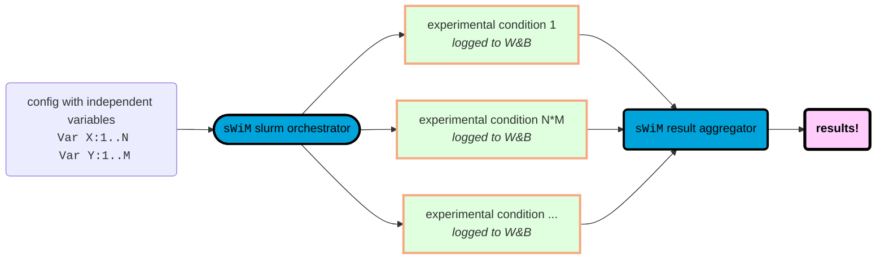
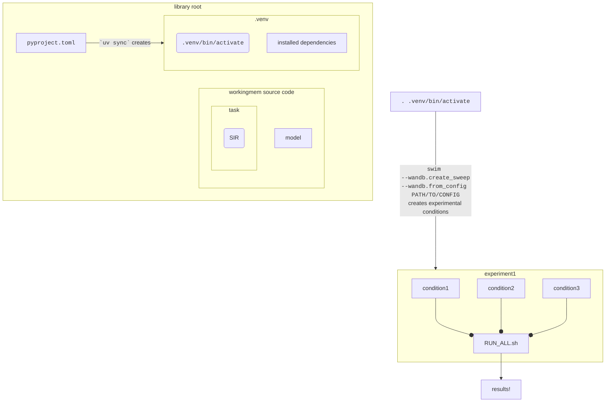

<h2>  <code>sWiM</code> 🏊: simulation of working memory management with neural networks  </h2>

- [Introduction](#introduction)
- [Usage](#usage)
- [Install](#install)
  - [CLI Options](#cli-options)
- [References](#references)

## Introduction
The [`swim`](https://aalok-sathe.github.io/working-memory) computational modeling framework serves to enable computational simulations of working memory tasks. 
A robustly-engineered framework allows researchers to define their own tasks and
generate datasets with fine control over the parameters of those tasks. The
framework allows for training neural models in an architecture-agnostic manner,
so long as they support a PyTorch backend. This includes transformers, recurrent
neural networks, and long short-term memory networks that can flexibly act as
_participants_ in the same tasks, allowing for clean, controlled comparisons
across model instantiations. Users of this framework can add their own models
to work with the rest of the framework as long as they provide a wrapper
that conforms with the 
[model wrapper interface](https://aalok-sathe.github.io/working-memory/workingmem/model.html#ModelWrapper).
Similarly, users can use the default supported Reference-Back task from
[Rac-Lubashevsky & Kessler (2016)](#references) implemented here, or provide their own implementation
that conforms to the 
[dataset interface](https://aalok-sathe.github.io/working-memory/workingmem/task/interface.html#GeneratedCachedDataset).

Integration with the [weights & biases (`wandb`)](https://wandb.ai)
experiment-tracking platform promotes robust, open, and replicable science by
constructing uniquely-tagged and documented config-driven experiments for each
condition a researcher may be interested in. These experimental conditions live
in separate spaces on the disk, each with meticulously-documented metadata that
makes discerning results and analyzing data pleasantly organized. Furthermore,
the software supports exposure and transfer-learning experiments using these
same condition-based tags, allowing precise documentation of the entire training
history of a computational model and subsequent experiments on pretrained
models.

<h3> Config-driven experimentation </h3>

You could run an end-to-end experiment fully without writing any code!
A config-driven design allows you to specify an experiment in a YAML file. Furthermore, configs allow specifying lists of values a variable can take, and spawn many conditions of the experiment (e.g., contrasting two model architectures). However, there may be variables that you do not want to vary across conditions, such as tuned hyperparameters that don't have bearing on the experimental conditions. To accomodate this, [a config has two sections](https://aalok-sathe.github.io/working-memory/workingmem#config-structure), _independent variables_ and _conditional variables_.  




## Usage
Reference the API documentation along with helpful high-level descriptions [here](https://aalok-sathe.github.io/working-memory). 
We have a few tutorials to guide you through how to use this library and framework, [here](https://aalok-sathe.github.io/working-memory/workingmem.html#config-structure). Tutorials cover many use-cases, including how to write a config to orchestrate a simple experiment with multiple experimental conditions and dependent/conditional variables.


## Install
1.  **install `uv`** 

    `sWiM` uses `uv` as its dependency manager. you'll need to install it if you don't already have it. it is lightweight and very quick to install. visit https://github.com/astral-sh/uv#installation for instructions.

1. **install `sWiM`**
      - `uv sync` in the project root directory (this is the directory where the `pyproject.toml` file lives): install the python virtual environment with all requisite packages (needed once)
      - `. ./.venv/bin/activate`: activate the virtual environment in the directory of the library---execute this also from the project root directory, where the `pyproject.toml` file lives.
      (needed each time you log in to your computer or compute node until you exit/log out of that session)
    



3. **use with Weights and Biases (recommended)**
    - `sWiM` is best used alongside weights and biases. for this you will have to create an account on the [W&B website](https://wandb.ai). there are many ways in which to do so, including using your existing github account.
    it's possible to use `sWiM` without a W&B integration at the
    cost of full functionality (W&B is mainly used as a database for creating and orchestrating experiments on top of the core `sWiM` framework; you can still call `sWiM` and train/evaluate models just the same via CLI or a programmatic interface when imported as a library.)


### CLI Options
```bash
python -m workingmem 
--------------------
  -h, --help: 
    see a list of all options

  --[model|dataset|trainer|wandb].FOO BAR: 
    pass the value 'BAR' to [model|dataset|trainer|wandb] parameter "FOO". e.g., "--model.model_class lstm" or "--dataset.n_back 5"
    
```

<h4> Options</h4>

- [Model options](https://aalok-sathe.github.io/working-memory/workingmem/model.html#ModelConfig) are passed in as `--model.XYZ` for a parameter titled `XYZ`. This sets model parameters and hyperparamas such as the model class (e.g., `lstm`), number of layers, dimensionality, etc.
- [Dataset options](https://aalok-sathe.github.io/working-memory/workingmem/task/SIR/SIR.html#SIRConfig) are passed in as `--dataset.XYZ` for an option titled `XYZ` to set dataset parameters such as `concurrent_roles`, `n_back`, `n_train`, `n_trials`, etc.
- [Trainer options](https://aalok-sathe.github.io/working-memory/workingmem/model.html#TrainingConfig) are passed in as `--trainer.XYZ` for an option titled `XYZ` to set trainer hyperparameters such as `learning_rate`.
- [W&B integration options](https://aalok-sathe.github.io/working-memory/workingmem.html#WandbConfig) are passed in as `--wandb.XYZ` for an option titled `XYZ` to use W&B integration directives such as `create_sweep` or `run_sweep [SWEEP_ID]` .
- [Additional options](https://aalok-sathe.github.io/working-memory/workingmem.html#MainConfig) can be supplied for a limited number of settings such as setting the compute cluster slurm account/partition names, specifying whether to filter model loading from pre-trained by accuracy threshold, etc.
 

## References
- Rac-Lubashevsky, R., & Kessler, Y. (2016). Dissociating working memory updating and automatic updating: The reference-back paradigm. _Journal of Experimental Psychology: Learning, Memory, and Cognition, 42_(6), 951–969. https://doi.org/10.1037/xlm0000219
- O’Reilly, R. C., & Frank, M. J. (2006). Making Working Memory Work: A Computational Model of Learning in the Prefrontal Cortex and Basal Ganglia. _Neural Computation, 18_(2), 283–328. https://doi.org/10.1162/089976606775093909


