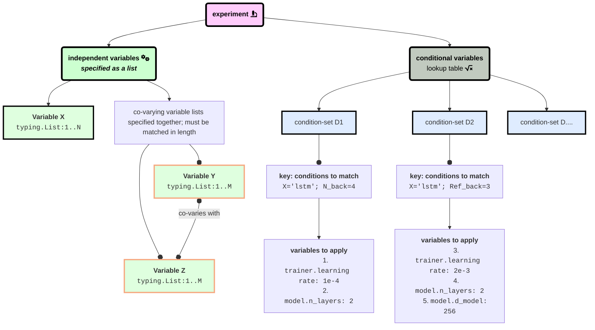

## Tutorials

### Config structure
Configs define an experiment instance. An experiment consists of independent variables that we may want to vary along (e.g., multiple set-size or `N` values for Reference-back or N-back tasks, or multiple different model architectures). All independent variables can take on multiple values. To support string types as values, all values are wrapped in a list, even if passing a single value (e.g., `['lstm']` or `['lstm', 'rnn']`). Passing a singleton not wrapped in a list will result in an error.

Any of the parameters specified [here](#options-applicable-to-config-and-cli) can be used as variables.

#### Independent variables



### Creating and using the virtual environment using `uv`

```mermaid
flowchart LR
  subgraph R [library root]
    subgraph v [<code>.venv</code>]
      binactivate( <code>.venv/bin/activate</code> )
      packages[installed dependencies]
    end

    p[<code>pyproject.toml</code>] -->| <code>`uv sync`</code> creates | v


    subgraph wm [workingmem source code]
      subgraph model
        LSTM(LSTM)
        transformer( transformer )
        _etc( etc. )
      end
      subgraph task
        SIR(SIR)
      end
    end

  end
  ```
 

### Create your first experiment sweep
1. Start with the example config:

    [ `example_config.yaml` ](https://github.com/aalok-sathe/working-memory/blob/main/configs/sample_conditional_config.yaml):
    ```
    #### independent_variables
    # this section contains a list of dictionaries, each containing 
    #   key: [values]
    # pairs. any independent variables that co-vary are grouped into a single dictionary whose values are the same length. a zip() over the values is used in the product between the values.
    
    independent_variables:
      - dataset.td_prob: [0]
      - dataset.role_n_congruence: [0]
      - dataset.n_back: [3,4,5,6]
        dataset.concurrent_reg: [3,4,5,6]
      - model.model_class: ['rnn', 'lstm', 'transformer']

    #### conditional variables
    # they are looked-up based on matching index.  we go sequentially through the list of conditional variables and iterate over the index. for each (key, value) in the index we try to match the current instance of parameter combinations of independent variables. place the most narrowly-scoped index entries at the top of the list and the most general and widely-scoped index entries at the end. i.e., defaults, if any, should go at the very end. 

    conditional_variables:
      - index:
          model.model_class: 'transformer'
          dataset.td_prob: 0 
        kwargs:
          trainer.learning_rate: 2.2e-4
    ```

1. use `python -m workingmem --wandb.create_sweep` with the flag `--wandb.from_config [path/to/config]` to create individual experimental conditions. at this point, the library computes a cross-product over all possible conditions in your config and creates individual "sweeps" for each condition.

```mermaid
  flowchart LR

    subgraph experiment [experiment1]
      condition1[condition1]
      condition2[condition2]
      condition3[condition3]
      R[<code>RUN_ALL.sh</code>]
    end

    condition1 --- R
    condition2 --- R 
    condition3 --- R

    config1[<code>. .venv/bin/activate</code>] -->| <code>swim \n--wandb.create_sweep\n--wandb.from_config PATH/TO/CONFIG</code>\ncreates experimental conditions | experiment 

    R --> results!

```