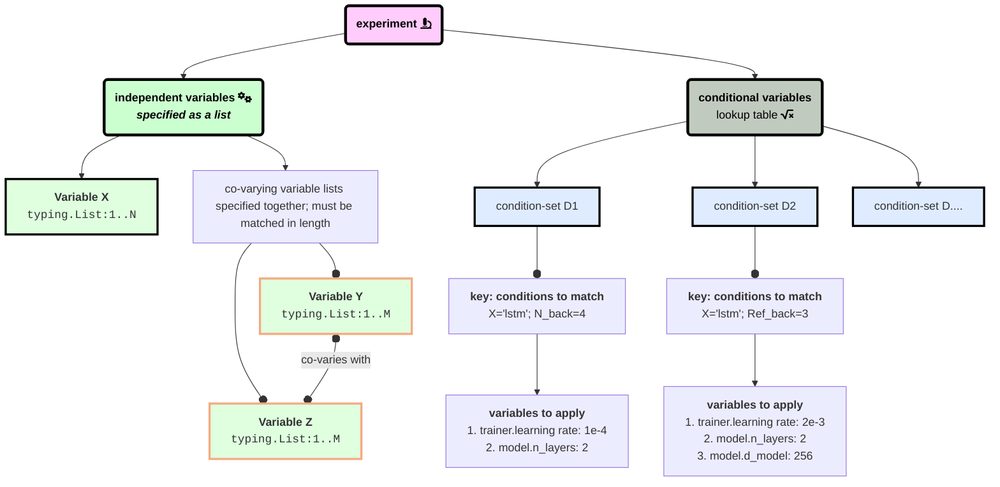

# Tutorials

## Config structure

## Create your first experiment sweep
1. identify manipulations of interest (see what variations the library already supports using `python -m workingmem -h`).
2. write/modify a config defining experimental conditions ([example](./configs/sample_conditional_config))
    - configs follow an "independent variables" and "conditional variables" format---independent variables are enumerated as lists
      that yield a cross-product over all possible combinations of their variation. "conditional variables" are typically hyperparameters
      that need to be looked up dependent on the particular condition.  
3. use `python -m workingmem --wandb.create_sweep` along with the flag `--wandb.from_config [path/to/config]` to define individual experimental conditions.
  at this point, the library evaluates a cross-product over all possible conditions in your experiment and creates individual
  W&B "sweeps" for each condition. this enables separate tracking of the progress of experiments in a web browser, as well as unique-ID-based
  retrieval after the experiment finishes for clean, reproducible science.
